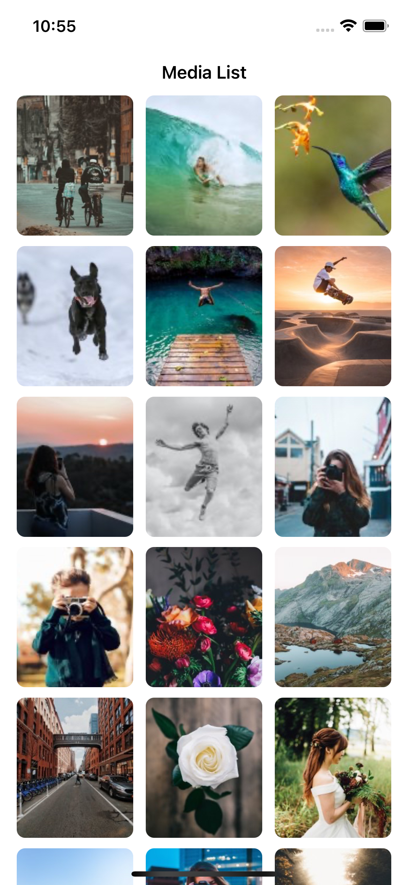

# GalleryImages

This app can show images on the screen. I've created it based on the clean architecture and MVVM-C pattern.
 
the flow application handles by coordinator pattern.
 

  At the first, App runs and fetch data from the service. after that All data can cache on the mongodb. I use realm-MongoDB for caching data.

# Architecture
Based on the clean architecture

<b>Kiliaro</b>
 
    -------> <b>Application</b> // UI elements and pages
     
     
    -------> <b>APIPlaform</b> // Platform Layer
     
     
    -------> <b>DBPlatform</b> // Platform Layer
         
     
    -------> <b>RepositoryPlatform</b> // Platform Layer
         
     
    -------> <b>Domain</b> // Domain Layer include use cases and entites
         
     
